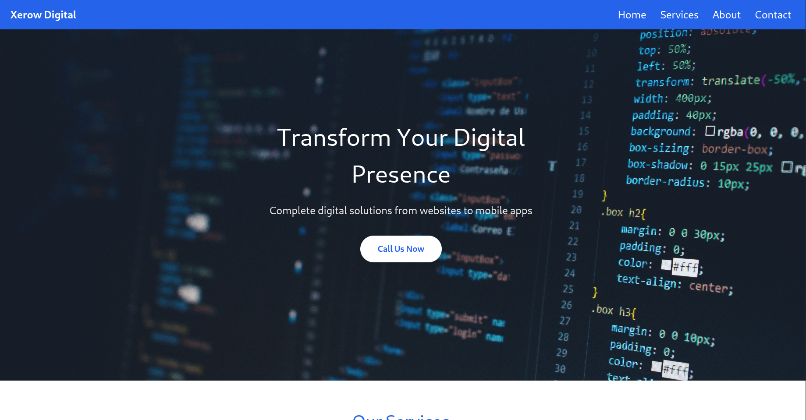

# This project is webiste for Digital Marketing & PR ,web designing and web developing. 

### Prerequisits for running the project locally
Make sure you have [git](https://git-scm.com) installed obviously.  
Make sure you have [bun](https://bun.sh) installed.
## Steps to clone this repo and start working


1. Clone this repsitory
```bash
git clone https://gitlab.com/xerofenix/xerow-digital
```
or
```bash
git clone https://github.com/xerofenix/digital-solution.git
```
and enter to cloned folder

2. Create a git branch
```bash
git branch <your-choice-of-branch-name>
```
3. Change the branch
```bash
git switch <your-branch-name>
```
Make sure to enter the same branch name in step 3 that you created in step 2.

Now run the project. Open a termianl in the same directory and enter
```bash
bun run dev
```
You will see the output   
`$ bun --hot src/index.tsx`  
`🚀 Server running at http://localhost:3000/`  
`Bundled page in 43ms: src/index.html`

Congratulations! You did it.

Now open your browser and go to `htt://localhost:300` or simply press ctrl+click  on `http://localhost:3000` in your terminal. you will see something 

